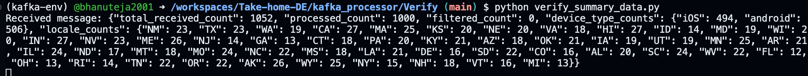

# Kafka-Based Real-Time Data Processing Pipeline

## Overview

This project implements a real-time data processing pipeline using Apache Kafka, designed to efficiently consume, process, transform, and publish messages while ensuring robust error handling and summary statistics.

## Design Choices

### Architecture

The pipeline consists of several key components and utilizes four Kafka topics to manage data flow and logging:

1. **Topics**:
   - **`user-login`**: The source topic where raw login events are published.
   - **`processed-output`**: The destination topic for successfully transformed and processed messages.
   - **`processed-errors`**: A dedicated topic for logging errors encountered during processing, such as JSON decoding issues or missing fields.
   - **`summary-output`**: A topic for publishing summary statistics, including counts of processed messages, device types, locales, and filtered records.

2. **Components**:
   - **Consumer**: Subscribes to the `user-login` topic to read incoming messages.
   - **Producer**: Publishes transformed messages to `processed-output` and logs errors to `processed-errors`.
   - **Transformer**: Processes each message by hashing sensitive fields and formatting timestamps.
   - **Summary Printer**: Maintains processing statistics and publishes summaries to `summary-output`.

### Hashing

- **Purpose**: Hashing is used to protect sensitive information such as IP addresses and device IDs. By converting these fields into fixed-length hashes using SHA-256, we ensure that sensitive data is anonymized while maintaining the ability to uniquely identify records for analytical purposes.

## Data Flow

1. **Message Consumption**:
   - The consumer reads messages from the `user-login` topic.
   - Messages are decoded from JSON format.

2. **Validation and Filtering**:
   - Checks are performed for required fields (`user_id`, `ip`, `device_id`, etc.).
   - Messages with an `app_version` not equal to `'2.3.0'` are filtered out.

3. **Transformation**:
   - Sensitive fields are hashed for privacy.
   - Timestamps are converted to a human-readable format.

4. **Publishing**:
   - Transformed messages are sent to the `processed-output` topic.
   - Errors encountered during processing are logged to the `processed-errors` topic.

5. **Summary Statistics**:
   - Tracks processed message counts, device types, locales, and filtered records.
   - Publishes summary statistics every 1000 processed messages to the `summary-output` topic.

## Efficiency

- **Batching and Compression**: Configured with `linger.ms`, `batch.size`, and `compression.type` settings to optimize throughput.
- **Retries**: Set to 5 retries for transient errors to enhance reliability without significant delay.

## Scalability

- **Kafka's Partitioning**: Utilizes Kafka's partitioning feature to distribute load across multiple consumers efficiently.
- **Configuration Tuning**: Adjusts batching and compression settings to handle high message volumes effectively.

## Fault Tolerance

- **Manual Offset Management**: Ensures offsets are committed only after successful processing, preventing data loss.
- **Error Logging**: Comprehensive logging captures issues at each stage of processing for easy troubleshooting.
- **Redundancy**: Configurable replication factor in Kafka ensures message durability across broker failures.

## Getting Started

## Running the Pipeline

### Prerequisites

- Docker and Docker Compose
- Python 3.8.12
- Confluent Kafka Python client (`pip install confluent-kafka`)

### Steps to Run the Pipeline

1. **Start Your Kafka Broker**:
   - Use Docker Compose to start your Kafka broker. Navigate to the directory containing your `docker-compose.yml` file and run:
     ```bash
     docker-compose up
     ```

2. **Create a Virtual Environment**:
   - Navigate to your project directory and create a virtual environment using the given `requirements.txt`:
     ```bash
     python -m venv venv
     ```

3. **Activate the Virtual Environment**:
   - On Windows:
     ```bash
     .\venv\Scripts\activate
     ```
   - On macOS and Linux:
     ```bash
     source venv/bin/activate
     ```

4. **Install Dependencies**:
   - Install the required packages from `requirements.txt`:
     ```bash
     pip install -r requirements.txt
     ```

5. **Run the Main Pipeline**:
   - Navigate to the `kafka_processor` folder and run the main script:
     ```bash
     cd kafka_processor
     python main.py
     ```
   - You will see a message in the terminal saying "Kafka Consumer has started..."

6. **Verify Data Flow with Consumers**:
   - Open four new terminal windows, activate the virtual environment in each, and run the following scripts located under `kafka_processor/Verify/` to test if data is passed to these four topics:
     - For each terminal, navigate to your project directory and activate the virtual environment as shown in step 3.
     - Run each consumer script for the respective topics:
       ```bash
       python verify_processed_output.py    # Verifies messages in 'processed-output'
       python verify_processed_errors.py    # Verifies messages in 'processed-errors'
       python verify_summary_output.py      # Verifies messages in 'summary-output'
       python verify_cleaned_data.py        # Verifies messages in 'cleaned-data'
       ```

By following these steps, you can set up and run your Kafka-based real-time data processing pipeline, ensuring that all components are functioning correctly.

- **Note**: The `cleaned-data` topic will not show any values because all input records have an Android version of 2.3.0, which means no records are filtered out based on this criterion.

## Outputs

### 1. Kafka Producer Output

The Docker container for the Python producer generates messages as follows:


### 2. Running `main.py`

When running the main script, you should see:


### 3. Verifying Data Flow with Consumers


#### Processed Data

Running `verify_processed_data.py` shows:


#### Processed Errors

Running `verify_processed_errors.py` shows:


#### Summary Data

Running `verify_summary_data.py` shows:




#### Cleaned Data

**Note**: The `cleaned-data` topic will not show any values because all input records have an Android version of 2.3.0, meaning no records are filtered out based on this criterion.

