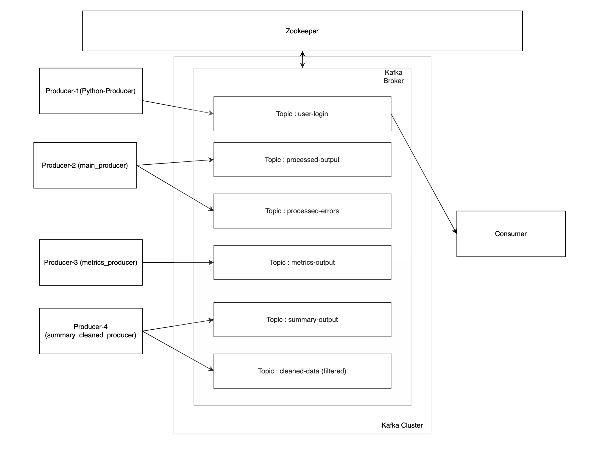
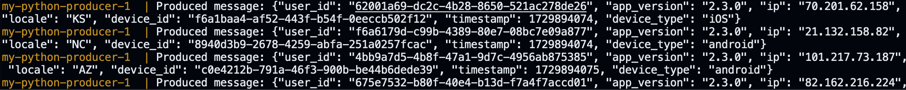
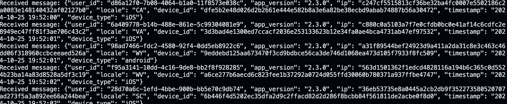
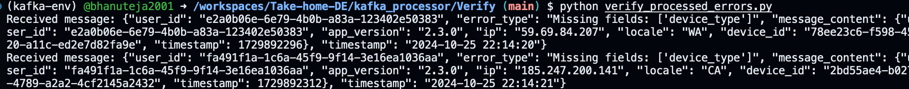
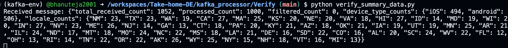
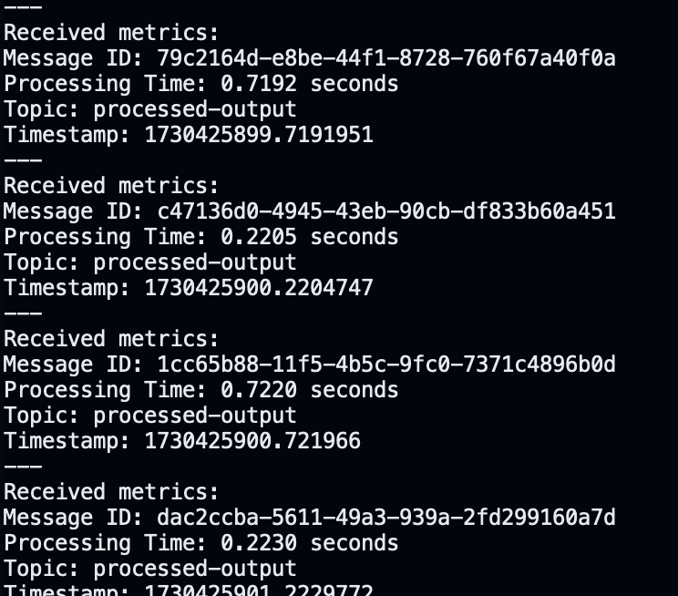

# Kafka-Based Real-Time Data Processing Pipeline (Take-home)




```
project-root/
│
├── docker-compose.yml          # Docker Compose file for setting up Kafka
├── requirements.txt            # Python dependencies
│
├── kafka_processor/            # Main processing folder
│   ├── main.py                 # Main script to run the pipeline
│   ├── producer.py             # Producer logic for Kafka
│   ├── consumer.py             # Consumer logic for Kafka
│   ├── transformer.py          # Message transformation logic
│   ├── summary_printer.py      # Summary statistics management
│   ├── metrics.py              # Metrics collection and management
│   └── Verify                  # Verification scripts for testing data flow
│       ├── verify_processed_output.py   # Verifies 'processed-output' topic
│       ├── verify_processed_errors.py   # Verifies 'processed-errors' topic
│       ├── verify_summary_data.py       # Verifies 'summary-output' topic
│       ├── verify_cleaned_data.py       # Verifies 'cleaned-data' topic
│       └── verify_metrics.py            # Verifies 'metrics-output' topic
│
└── README.md                   # Project documentation and setup instructions

```

## Overview

This project implements a real-time data processing pipeline using Apache Kafka, designed to efficiently consume, process, transform, and publish messages while ensuring robust error handling, summary statistics, metrics handling and performance metrics.


### Architecture

The pipeline consists of several key components and utilizes four Kafka topics to manage data flow and logging:

1. **Topics**:
   - **`user-login`**: The source topic where raw login events are published.
   - **`processed-output`**: The destination topic for successfully transformed and processed messages.
   - **`processed-errors`**: A dedicated topic for logging errors encountered during processing, such as JSON decoding issues or missing fields.
   - **`summary-output`**: A topic for publishing summary statistics, including counts of processed messages, device types, locales, and filtered records.
   - **`cleaned-data (Optional)`**: A topic for logging messages filtered out based on specific criteria (e.g., app_version)
   - **`metrics-output`**: A topic for publishing performance metrics.

2. **Components**:
   - **Consumer**: Subscribes to the `user-login` topic to read incoming messages.
   - **Producer**: Publishes transformed messages to `processed-output` and logs errors to `processed-errors`.
   - **Transformer**: Processes each message by hashing sensitive fields and formatting timestamps.
   - **Summary Printer**: Maintains processing statistics and publishes summaries to `summary-output`.
   - **Metrics Collector**: Tracks and publishes performance metrics.


## Data Flow


1. **Message Consumption**:
   - The consumer reads messages from the `user-login` topic using the create_consumer_with_retry function.
   - Messages are polled using the poll_message function.

2. **Age Filtering**:
   - Messages older than MAX_MESSAGE_AGE (60 seconds) are skipped.

3. **Message Parsing and Validation**:
   - Messages are decoded from JSON format.
   - Checks are performed for required fields (user_id, ip, device_id, app_version, device_type, timestamp, locale).
   - Messages with missing user_id or other required fields are logged as errors.

4. **App Version Filtering**:
   - Messages with an `app_version` not equal to '2.3.0' are filtered out and logged to the 'cleaned-data' topic.

5. **Transformation**:
   - Messages are transformed using the transform_message function, transformation include hashing (encoding) IP and DeviceID.

6. **Publishing**:
   - Successfully transformed messages are published to the `processed-output` topic.
   - Errors encountered during processing are logged to the `processed-errors` topic.

7. **Metrics Recording**:
   - Processing metrics are recorded for each message using the MessageMetrics class.
   - Metrics are published to the `metrics-output` topic after each message is processed.

8. **Summary Statistics**:
   - Tracks processed message counts, device types, and locales.
   - Publishes summary statistics every 1000 processed messages (SUMMARY_PUBLISH_INTERVAL) to the `summary-output` topic.

9. **Error Handling**:
   - Various error conditions (parsing errors, missing fields, transformation errors, publishing errors) are caught and logged to the `processed-errors` topic.

10. **Offset Management**:
    - The consumer manually commits offsets after successful message processing.

This data flow reflects the additional error handling, metrics recording, and more granular filtering present in your current implementation.


## Design Choices

### 1. Why a Modular Approach?

- **Flexibility**: A modular approach allows each component of the pipeline (e.g., consumer, producer, transformer) to be developed, tested, and maintained independently.
- **Reusability**: Code can be reused across different parts of the application or in future projects.
- **Scalability**: Modules can be scaled independently based on load and performance requirements.

### 2. Why Hashing device ID and masking ip address?

The decision to hash the device ID and mask the IP address is based on several privacy considerations and legal requirements:

1. Compliance with data protection laws:
   - GDPR considers IP addresses as personal data.
   - CCPA includes IP addresses and device IDs as personal information.

2. Balancing data utility and privacy:
   - Hashing device ID provides anonymization while maintaining unique identifier.
   - Masking IP address preserves some network-level information while protecting specific device identity.

3. Risk mitigation:
   - Reduces the risk of re-identification of individuals.
   - Enhances data security in case of breaches.

Advantages of this approach:

1. Legal compliance: Meets requirements of various privacy laws like GDPR and CCPA.
2. Data minimization: Adheres to the principle of collecting only necessary data.
3. Flexibility: Allows for data analysis while protecting individual privacy.
4. Trust building: Demonstrates commitment to user privacy, potentially improving reputation.
5. Reduced liability: Minimizes risks associated with storing identifiable personal information.
6. Maintained utility: Preserves some useful information for analytics and security purposes.

This approach strikes a balance between data protection and usability, addressing key privacy concerns while still allowing for necessary data processing and analysis.

### 3. Why Summary Statistics?

- **Real-Time Insights**: Summary statistics provide immediate visibility into the pipeline's operations, allowing for quick detection of potential issues or anomalies.
- **Business Intelligence**: These statistics enable the creation of dashboards that support data-driven business decisions and strategic planning.
- **Operational Efficiency**: By understanding data flow and processing trends, teams can optimize resource allocation and improve overall pipeline performance.
- **Proactive Monitoring**: Continuous tracking helps in identifying patterns that may require intervention, ensuring smooth and efficient pipeline operations.

### 4. Why Topic for Errors (processed-errors) Over Logs?

- **Centralized Error Handling**: Using a Kafka topic for errors allows centralized collection and analysis of issues across distributed systems.
- **Scalability**: Kafka's architecture supports high-throughput error logging without impacting system performance.
- **Durability**: Error messages are stored durably in Kafka, allowing for replay and analysis if needed.

### 5. Why Topic for Cleaned Data (Filtered Out Data)?

- **Data Quality Insights**: Logging filtered messages helps identify patterns or anomalies in the data that may require attention or adjustment in filtering criteria.
- **Audit Trail**: Provides a record of all data that was excluded from processing, which can be useful for compliance and auditing purposes.
- **Optimization**: Analyzing filtered data can lead to improvements in data collection processes or filtering logic, enhancing overall pipeline efficiency.

### 6. Why Manual Offset Management?

- **Data Integrity**: Ensures that offsets are committed only after successful message processing, preventing data loss or duplication.
- **Error Recovery**: Allows precise control over message acknowledgment, facilitating effective error recovery strategies.

### 7. Why Implement Retries?

- **Reliability Enhancement**: Setting retries to handle transient errors ensures that temporary network issues or broker unavailability do not result in message loss.
- **System Stability**: Retries help maintain consistent message delivery without significant delays, improving overall system robustness.

### 8. Why Use Batching and Compression?

- **Throughput Optimization**: Configuring `linger.ms`, `batch.size`, and `compression.type` helps maximize throughput by efficiently packaging messages for transmission.
- **Resource Efficiency**: Reduces network load and improves processing speed by minimizing the size of data packets sent over the network.

### 9. Why Implement Comprehensive Error Logging?

- **Troubleshooting**: Comprehensive logging captures issues at each stage of processing, providing detailed insights that facilitate quick identification and resolution of problems.
- **Operational Visibility**: By logging errors systematically, developers and operators gain a clear view of where and why failures occur, enabling proactive management of the pipeline.
- **Continuous Improvement**: Detailed error logs allow for analysis over time, helping to identify recurring issues and opportunities for optimization in the data processing workflow.


## Getting Started

## Running the Pipeline

### Prerequisites

- Docker and Docker Compose
- Python 3.8.12
- Confluent Kafka Python client (`pip install confluent-kafka`)

### Steps to Run the Pipeline

1. **Start Your Kafka Broker**:
   - Use Docker Compose to start your Kafka broker. Navigate to the directory containing your `docker-compose.yml` file and run:
     ```bash
     docker-compose up
     ```

2. **Create a Virtual Environment**:
   - Navigate to your project directory and create a virtual environment using the given `requirements.txt`:
     ```bash
     python -m venv kafka-env
     ```
     or
     
      ```bash
     conda create --name your_env_name python=3.8
     ```

3. **Activate the Virtual Environment**:
   - On Windows:
     ```bash
     .\kafka-venv\Scripts\activate
     ```
   - On macOS and Linux:
     ```bash
     source kafka-venv/bin/activate
     ```
   - conda users
      ```bash
     conda activate your_env_name
     ```

4. **Install Dependencies**:
   - Install the required packages from `requirements.txt`:
     ```bash
     pip install -r requirements.txt
     ```

5. **Run the Main Pipeline**:
   - Navigate to the `kafka_processor` folder and run the main script:
     ```bash
     cd kafka_processor
     python main.py
     ```
   - You will see a message in the terminal saying "Kafka Consumer has started..."

6. **Verify Data Flow with Consumers**:
   - Open four new terminal windows, activate the virtual environment in each, and run the following scripts located under `kafka_processor/Verify/` to test if data is passed to these four topics:
     - For each terminal, navigate to your project directory and activate the virtual environment as shown in step 3.
     - Run each consumer script for the respective topics:
       ```bash
          python verify_processed_output.py
          python verify_processed_errors.py
          python verify_summary_output.py
          python verify_cleaned_data.py
          python verify_metrics_data.py
       ```

By following these steps, you can set up and run your Kafka-based real-time data processing pipeline, ensuring that all components are functioning correctly.

- **Note**:
1. The `cleaned-data` topic will not show any values because all input records have an Android version of 2.3.0, which means no records are filtered out based on this criterion.

2. I have used Github CodeSpaces to implement this project!


## Outputs

### 1. Python Producer Output

The Docker container for the Python producer generates messages as follows:



Looking at this we feel like this data is processed in real-time for analytics or can be used to login to any application.


### 2. Running `main.py`

When running the main script, you should see:


### 3. Verifying Data Flow with Consumers


#### Processed Data

Running `verify_processed_data.py` shows:




#### Processed Errors

Running `verify_processed_errors.py` shows:




#### Summary Data

Running `verify_summary_data.py` shows:



#### Metrics Data

Running `verify_metrics_data.py` shows:



PS: Here modified verify-metrics to make it look neat but this is how it will look


#### Cleaned Data

**Note**: The `cleaned-data` topic will not show any values because all input records have an Android version of 2.3.0, meaning no records are filtered out based on this criterion.


## Future Scope (Additional Questions)


### 1. How would you deploy this application in production?

- Containerize the application components using Docker
- Deploy on Kubernetes for container orchestration and scaling
- Set up a CI/CD pipeline (e.g., Jenkins, GitLab CI, or GitHub Actions)
- Use a production-grade Kafka cluster using services like confluent cloud.
- Implement servies like Datadog for comprehensive monitoring and observability
- Use infrastructure-as-code tools like Terraform for configuration management

### 2. What other components would you want to add to make this production ready?

- Implement a schema registry (e.g., Confluent Schema Registry)
- Set up SSL/TLS encryption for data in transit
- Implement data lineage and governance tools to track data flow and ensure compliance.
- Implement Performance Testing
- Configure PagerDuty, OpsGenie or Datadog Alerts for critical failures or performance issues
- Implement a robust backup and disaster recovery strategy

### 3. How can this application scale with a growing dataset?

- Increase the number of partitions for each topic to allow for better parallelism and distribution of data.
- Move from a single broker to a multi-broker cluster allowing for better distribution of partitions across multiple servers, increasing throughput and fault tolerance.
- Upgrade hardware resources (CPU, RAM, disk) of Kafka brokers and application servers (Vertical Scaling)
- Instead of a single consumer, create a consumer group with multiple consumers allowing for parallel processing of messages from different partitions
- For complex data processing, Kafka Streams can help scale your data processing pipeline.
- Kafka Connect can help in efficiently moving data in and out of Kafka at scale.
- Use stream processing frameworks like Kafka Streams or Apache Flink for efficient real-time processing
- Implement intelligent load balancing for consumers
- Deploying Kafka on Kubernetes for easier scaling and management.
- Set up auto-scaling based on monitoring metrics

